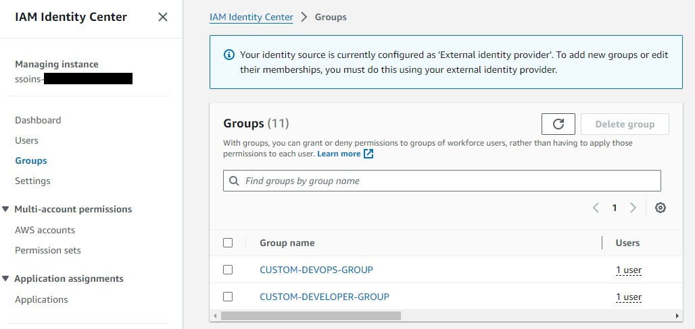
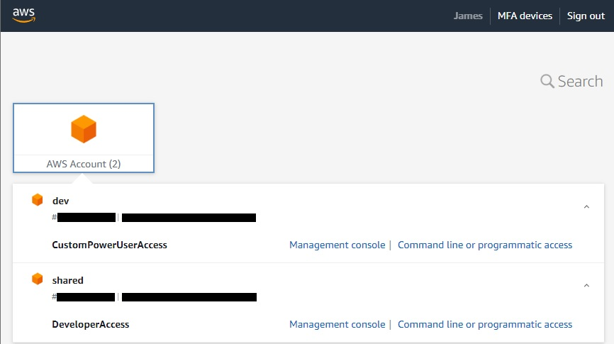
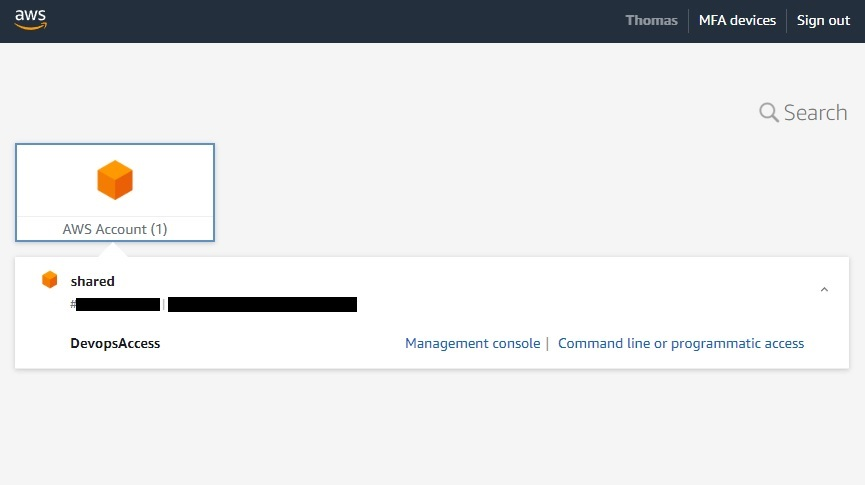
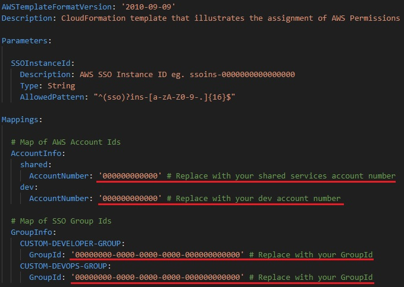

# AWS IAM Identity Center Group Permissions

This project provides a CloudFormation Template that demonstrates the assignment of AWS Permissions to existing AWS IAM Identity Center Groups.

## Prerequisites
At the time of writing (2024-03) it's not currently possible to define IAM Identity Center Users and Groups via CloudFormation.

This project assumes an environment with a Shared Services Account and Development Account with IAM Identity Center users, groups and user-group relationships already created (either manually via the AWS Console or synced from an External Identity Provider) for the following groups:
- `CUSTOM-DEVOPS-GROUP`
- `CUSTOM-DEVELOPER-GROUP`



## How it works

The CloudFormation Template will:
- Create a 'DevopsAccess' permission set that provides complete control over CodeCommit in addition to CodeBuild, CodeDeploy & CodePipeline.
- Create a 'DeveloperAccess' permission set that provides the ability to read/write to all CommitCode Repositories (but denying the ability to commit directly to main/develop branches).
- Create a 'CustomPowerUserAccess' permission set that provides full access to AWS services and resources, but does not allow management of users and groups.
- Assigns the 'CustomPowerUserAccess' permission set to the 'CUSTOM-DEVOPS-GROUP' group for the 'Shared Services Account'.
- Assigns the 'DeveloperAccess' permission set to the 'CUSTOM-DEVELOPER-GROUP' group for the 'Shared Services Account'.
- Assigns the 'CustomPowerUserAccess' permission set to the 'CUSTOM-DEVELOPER-GROUP' group for the 'Development Account'.

How this appears to end users:

 

## Modifying the Template
The CloudFormation Template is not intended to work out-of-the-box and will require changes specific to your AWS environment.
- The 'Account Number' for the 'Shared Services Account' and 'Development Accont' will need to be replaced.
- The 'Group ID' for each IAM Identity Center Group will need to be replaced.



## Deploying the template

The CloudFormation Template is intended to be deployed into the account that defines your IAM Identity Center Identity Store (either the 'master account' or 'delegated admin' account depending on your configuration).

## Using Google Workspaces as an External Identity Provider

It is possible to [Configure SAML and SCIM with Google Workspace and IAM Identity Center](https://docs.aws.amazon.com/singlesignon/latest/userguide/gs-gwp.html) for use as an external identity provider.

An important caveat is that SCIM automatic synchronization from Google Workspace only supports provisioning users; groups aren't automatically provisioned. Additionally once you have configured an IDP it is nolonger possible to add groups using the AWS Management Console. It is therefore necesssary to create groups (and user-group relationships) using the AWS CLI or API operations.

1. Example of using the CLI to create a group
```
aws identitystore create-group --identity-store-id d-0000000000 --display-name CUSTOM-DEVELOPER-GROUP
```

2. Example of using the CLI to add a user to a group
```
aws identitystore create-group-membership --identity-store-id d-0000000000 --group-id 00000000-0000-0000-0000-000000000000 --member-id UserId=00000000-0000-0000-0000-000000000000
```
- NOTE 1: The 'Identity store ID' can be found in 'IAM Identity Center > Settings > Identity source'.
- NOTE 2: If you do not have access to a jump box on which to run these commands then CloudShell can provide an effective way to execute these commands from inside the AWS Console.
- NOTE 3: These commands will need to be ran against the account that defines the IAM Identity Center Identity Store (either the 'master account' or 'delegated admin' account depending on your configuration).